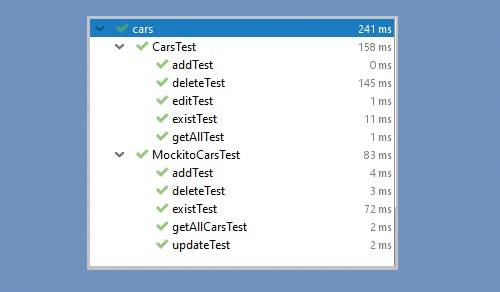
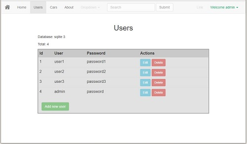
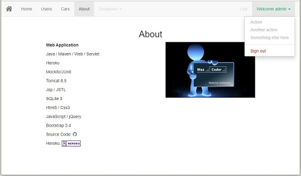

# WebAplication 
@author: Maksym Gorbunov

* Java
* Heroku
* Tomcat 8.5
* jsp / JSTL
* SQLite 3
* Html5 / Css3
* JS / jQuery
* Bootstrap 3.4
* Dependency Injection
* Mockito / JUnit Test

_____________________________________________________________________

for sqlite3 change 1 row in Models constructor: 
"this.db = new FakeCarsDBHelper()" to "this.db = db";
current version data in memory, because heroku does't support filesystem     

  
